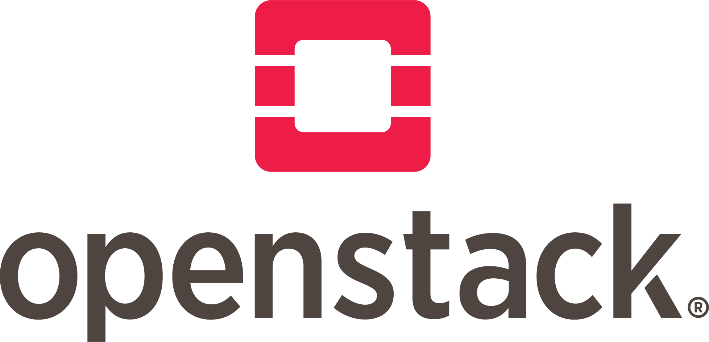

## Awesome OpenStack Cloud 

> 😎 Awesome lists about OpenStack: Open Source Cloud Computing Infrastructure

### Contents

* [Documentation](#documentation)
* [Services](#services)
* [Community](#community)
* [Books](#books)
* [Cloud Provider](#cloud-provider)
* [Consulting](#consulting)
* [Deployment Tools](#deployment-tools)
* [Software Development Kits](#software-development-kits)
* [Certification](#certification)
* [Blogs](#blogs)
* [Control Panel & Billing](#control-panel-and-billing-platforms)
* [YouTube Channels](#youtube-channels)
* [Distributions](#distributions)

### Documentation

OpenStack Documentation is a collection of documents that explain how to install, configure and use each OpenStack
service. The documentation is written by the OpenStack community.

* [OpenStack Documentation](https://docs.openstack.org/) - Official Documentation
* [OpenStack Installation Guide](https://docs.openstack.org/install-guide/) - Installation Guide

### Services
OpenStack is a bunch of services that work together depending on your cloud needs. OpenStack is broken up into services
to allow you to plug and play components depending on your needs. OpenStack services each have their own APIs.

##### Compute
* [Nova](#nova---compute-service) - Compute Service
* [Zun](#zun---container-service) - Container Service

#### Networking
* [Neutron](#neutron---networking-service) - Networking Service
* [Octavia](#octavia---load-balancing-service) - Load Balancing Service
* [Designate](#designate---dns-service) - DNS Service

#### Storage
* [Cinder](#cinder---block-storage-service) - Block Storage Service
* [Swift](#swift---object-storage-service) - Object Storage Service
* [Manila](#manila---shared-file-systems-service) - Shared File Systems Service

#### Identity
* [Keystone](#keystone---identity-service) - Identity Service

#### Image, Snapshot and Backup
* [Glance](#glance---image-service) - Image Service
* [Freezer](#freezer---backup-and-restore-service) - Backup and Restore Service

#### Hardware Lifecycle
* [Ironic](#ironic---bare-metal-service) - Bare Metal Service
* [Cyborg](#cyborg---accelerator-management-service) - Accelerator Management Service

#### Key Management
* [Barbican](#barbican---key-manager-service) - Key Manager Service

#### Orchestration
* [Heat](#heat---orchestration-service) - Orchestration Service
* [Senlin](#senlin---clustering-service) - Clustering Service
* [Mistral](#mistral---workflow-service) - Workflow Service
* [Zaqar](#zaqar---messaging-service) - Messaging Service
* [Blazar](#blazar---resource-reservation-service) - Resource Reservation Service

#### Workload Provisioning
* [Magnum](#magnum---container-orchestration-engine-provisioning) - Container Orchestration Engine Provisioning (Kubernetes, Docker Swarm, Mesos, etc.)
* [Sahara](#sahara---data-processing-service) - Data Processing Service
* [Trove](#trove---database-service) - Database Service

#### Telemetry
* [Watcher](#watcher---resource-optimization-service) - Resource Optimization Service
* [Placement](#placement---resource-inventory-service) - Resource Inventory Service
* [Aodh](#aodh---telemetry-alarming-service) - Telemetry Alarming Service

#### Application Lifecycle
* [Masakari](#masakari---high-availability-service) - High Availability Service
* [Murano](#murano---application-catalog-service) - Application Catalog Service
* [Solum](#solum---application-lifecycle-management-service) - Application Lifecycle Management Service

#### API Proxies
* [EC2API](#ec2api---ec2-compatibility-api-service) - EC2 Compatibility API Service

#### Dashboard
* [Horizon](#horizon---dashboard-service) - Dashboard Service
* [Skyline](#skyline---dashboard-service) - Dashboard Service

### Keystone - Identity Service
OpenStack Keystone provides authentication, authorization and service discovery mechanisms via HTTP primarily for use by
projects in the OpenStack family. It is most commonly deployed as an HTTP interface to existing identity systems, such
as LDAP.

* [Keystone](https://docs.openstack.org/keystone/latest/) - Official Documentation
* [Keystone API](https://docs.openstack.org/api-ref/identity/v3/) - REST API documentation
* [Keystone API Reference](https://developer.openstack.org/api-ref/identity/v3/) - REST API Reference
* [Repository](https://opendev.org/openstack/keystone) - Source Code
* [Developer Guide](https://docs.openstack.org/keystone/latest/contributor/index.html) - If you want to contribute to
  Keystone

### Nova - Compute Service
OpenStack Nova provides a cloud computing fabric controller, supporting a wide variety of compute technologies, including: libvirt (KVM, Xen, LXC and more), Hyper-V, VMware and OpenStack Ironic.

* [Nova](https://docs.openstack.org/nova/latest/) - Official Documentation
* [Nova API](https://docs.openstack.org/api-ref/compute/) - REST API documentation
* [Nova API Reference](https://developer.openstack.org/api-ref/compute/) - REST API Reference
* [Repository](https://opendev.org/openstack/nova) - Source Code
* [Developer Guide](https://docs.openstack.org/nova/latest/contributor/index.html) - If you want to contribute to Nova

### Neutron - Networking Service
Neutron is an OpenStack project to provide "network connectivity as a service" between interface devices (e.g., vNICs) managed by other OpenStack services (e.g., Nova).

* [Neutron](https://docs.openstack.org/neutron/latest/) - Official Documentation
* [Neutron API](https://docs.openstack.org/api-ref/network/) - REST API documentation
* [Neutron API Reference](https://developer.openstack.org/api-ref/network/) - REST API Reference
* [Repository](https://opendev.org/openstack/neutron) - Source Code
* [Developer Guide](https://docs.openstack.org/neutron/latest/contributor/index.html) - If you want to contribute to Neutron

### Cinder - Block Storage Service
Cinder is the block storage service for OpenStack. It's designed to present storage resources to end users that can be consumed by the OpenStack Compute Project (Nova).

* [Cinder](https://docs.openstack.org/cinder/latest/) - Official Documentation
* [Cinder API](https://docs.openstack.org/api-ref/block-storage/) - REST API documentation
* [Cinder API Reference](https://developer.openstack.org/api-ref/block-storage/) - REST API Reference
* [Repository](https://opendev.org/openstack/cinder) - Source Code
* [Developer Guide](https://docs.openstack.org/cinder/latest/contributor/index.html) - If you want to contribute to Cinder

### Glance - Image Service
Glance is an OpenStack project that provides services and associated libraries to store, browse, share, distribute and manage bootable disk images, other data closely associated with initializing compute resources, and metadata definitions.

* [Glance](https://docs.openstack.org/glance/latest/) - Official Documentation
* [Glance API](https://docs.openstack.org/api-ref/image/) - REST API documentation
* [Glance API Reference](https://developer.openstack.org/api-ref/image/) - REST API Reference
* [Repository](https://opendev.org/openstack/glance) - Source Code
* [Developer Guide](https://docs.openstack.org/glance/latest/contributor/index.html) - If you want to contribute to Glance

### Swift - Object Storage Service
OpenStack Swift is a distributed object storage system designed to scale from a single machine to thousands of servers. Swift is optimized for multi-tenancy and high concurrency. Swift is ideal for backups, web and mobile content, and any other unstructured data that can grow without bound.

* [Swift](https://docs.openstack.org/swift/latest/) - Official Documentation
* [Swift API](https://docs.openstack.org/api-ref/object-store/) - REST API documentation
* [Swift API Reference](https://developer.openstack.org/api-ref/object-store/) - REST API Reference
* [Repository](https://opendev.org/openstack/swift) - Source Code
* [Developer Guide](https://docs.openstack.org/swift/latest/contributor/index.html) - If you want to contribute to Swift

### Horizon - Dashboard Service
Horizon is the canonical implementation of OpenStack's Dashboard, which provides a web based user interface to OpenStack services including Nova, Swift, Keystone, etc.

* [Horizon](https://docs.openstack.org/horizon/latest/) - Official Documentation
* [Horizon API](https://docs.openstack.org/api-ref/dashboard/) - REST API documentation
* [Horizon API Reference](https://developer.openstack.org/api-ref/dashboard/) - REST API Reference
* [Repository](https://opendev.org/openstack/horizon) - Source Code
* [Developer Guide](https://docs.openstack.org/horizon/latest/contributor/index.html) - If you want to contribute to Horizon

### Heat - Orchestration Service
Heat is a service to orchestrate multiple composite cloud applications using templates, through both an OpenStack-native REST API and a CloudFormation-compatible Query API.

* [Heat](https://docs.openstack.org/heat/latest/) - Official Documentation
* [Heat API](https://docs.openstack.org/api-ref/orchestration/) - REST API documentation
* [Heat API Reference](https://developer.openstack.org/api-ref/orchestration/) - REST API Reference
* [Repository](https://opendev.org/openstack/heat) - Source Code
* [Developer Guide](https://docs.openstack.org/heat/latest/contributor/index.html) - If you want to contribute to Heat

### Designate - DNS Service
Designate provides DNS-as-a-Service for OpenStack. It provides a multi-tenant REST API for domain & record management, and provides a framework for integration with existing DNS services.

* [Designate](https://docs.openstack.org/designate/latest/) - Official Documentation
* [Designate API](https://docs.openstack.org/api-ref/dns/) - REST API documentation
* [Designate API Reference](https://developer.openstack.org/api-ref/dns/) - REST API Reference
* [Repository](https://opendev.org/openstack/designate) - Source Code
* [Developer Guide](https://docs.openstack.org/designate/latest/contributor/index.html) - If you want to contribute to Designate

### Magnum - Container Orchestration Engine Provisioning
Magnum is an OpenStack project which offers container orchestration engines for deploying and managing containers as first class resources in OpenStack. (Kubernetes, Docker Swarm, Mesos, etc.)

* [Magnum](https://docs.openstack.org/magnum/latest/) - Official Documentation
* [Magnum API](https://docs.openstack.org/api-ref/container-infrastructure-management/) - REST API documentation
* [Magnum API Reference](https://developer.openstack.org/api-ref/container-infrastructure-management/) - REST API Reference
* [Repository](https://opendev.org/openstack/magnum) - Source Code
* [Developer Guide](https://docs.openstack.org/magnum/latest/contributor/index.html) - If you want to contribute to Magnum

### Manila  - Shared File Systems Service
Manila provides an open, vendor-neutral API for managing shares in a cloud environment. The project aims to deliver a set of services for management of file shares (such as NFS and CIFS) as well as an open framework for integration with traditional storage vendors and emerging solutions like hyper-convergence and software-defined storage.

* [Manila](https://docs.openstack.org/manila/latest/) - Official Documentation
* [Manila API](https://docs.openstack.org/api-ref/shared-file-systems/) - REST API documentation
* [Manila API Reference](https://developer.openstack.org/api-ref/shared-file-systems/) - REST API Reference
* [Repository](https://opendev.org/openstack/manila) - Source Code
* [Developer Guide](https://docs.openstack.org/manila/latest/contributor/index.html) - If you want to contribute to Manila

### Octavia - Load Balancing Service
Octavia provides the load balancing API for OpenStack. It supports multiple "provider drivers" that implement load balancing, including the "amphora" reference driver included with Octavia.

* [Octavia](https://docs.openstack.org/octavia/latest/) - Official Documentation
* [Octavia API](https://docs.openstack.org/api-ref/load-balancer/) - REST API documentation
* [Octavia API Reference](https://developer.openstack.org/api-ref/load-balancer/) - REST API Reference
* [Repository](https://opendev.org/openstack/octavia) - Source Code
* [Developer Guide](https://docs.openstack.org/octavia/latest/contributor/index.html) - If you want to contribute to Octavia

### Sahara - Data Processing Service
Sahara provides a simple means to provision data processing frameworks (such as Apache Hadoop, Apache Spark and Apache Storm) on OpenStack.

* [Sahara](https://docs.openstack.org/sahara/latest/) - Official Documentation
* [Sahara API](https://docs.openstack.org/api-ref/data-processing/) - REST API documentation
* [Sahara API Reference](https://developer.openstack.org/api-ref/data-processing/) - REST API Reference
* [Repository](https://opendev.org/openstack/sahara) - Source Code
* [Developer Guide](https://docs.openstack.org/sahara/latest/contributor/index.html) - If you want to contribute to Sahara

### Trove - Database Service
Trove provides scalable and reliable Cloud Database as a Service functionality for both relational and non-relational database engines, and a single management interface for all of them.

* [Trove](https://docs.openstack.org/trove/latest/) - Official Documentation
* [Trove API](https://docs.openstack.org/api-ref/database/) - REST API documentation
* [Trove API Reference](https://developer.openstack.org/api-ref/database/) - REST API Reference
* [Repository](https://opendev.org/openstack/trove) - Source Code
* [Developer Guide](https://docs.openstack.org/trove/latest/contributor/index.html) - If you want to contribute to Trove

### Zun - Container Service
Zun is an OpenStack project which aims to provide an API service for running application containers without the need to manage servers or clusters.

* [Zun](https://docs.openstack.org/zun/latest/)  - Official Documentation
* [Zun API](https://docs.openstack.org/api-ref/container-infra/) - REST API documentation
* [Zun API Reference](https://developer.openstack.org/api-ref/container-infra/) - REST API Reference
* [Repository](https://opendev.org/openstack/zun) - Source Code
* [Developer Guide](https://docs.openstack.org/zun/latest/contributor/index.html) - If you want to contribute to Zun

### Ironic - Bare Metal Service
Ironic is an OpenStack project which provisions bare metal (as opposed to virtual) machines. It is best thought of as a bare metal hypervisor API and a set of plugins which interact with the bare metal hypervisors. By default, it will use PXE and IPMI in concert to provision and turn on/off machines, but Ironic also supports vendor-specific plugins which may implement additional functionality.

* [Ironic](https://docs.openstack.org/ironic/latest/) - Official Documentation
* [Ironic API](https://docs.openstack.org/api-ref/baremetal/) - REST API documentation
* [Ironic API Reference](https://developer.openstack.org/api-ref/baremetal/) - REST API Reference
* [Repository](https://opendev.org/openstack/ironic) - Source Code
* [Developer Guide](https://docs.openstack.org/ironic/latest/contributor/index.html) - If you want to contribute to Ironic

### Cyborg - Accelerator Management Service
Cyborg is an OpenStack project which aims to provide a general purpose management framework for acceleration resources (i.e. various types of accelerators, such as GPU, FPGA, ASIC, DPDK/SPDK, SSD, NVMe and so on).

* [Cyborg](https://docs.openstack.org/cyborg/latest/) - Official Documentation
* [Cyborg API](https://docs.openstack.org/api-ref/accelerator/) - REST API documentation
* [Cyborg API Reference](https://developer.openstack.org/api-ref/accelerator/) - REST API Reference
* [Repository](https://opendev.org/openstack/cyborg) - Source Code
* [Developer Guide](https://docs.openstack.org/cyborg/latest/contributor/index.html) - If you want to contribute to Cyborg

### Watcher - Resource Optimization Service
Watcher is an OpenStack project which aims to provide a flexible and scalable resource optimization service for multi-tenant OpenStack-based clouds. Watcher provides a robust framework to realize complex cloud optimization algorithms, which typically require a holistic view on the cloud.

* [Watcher](https://docs.openstack.org/watcher/latest/) - Official Documentation
* [Watcher API](https://docs.openstack.org/api-ref/infra-optim/) - REST API documentation
* [Watcher API Reference](https://developer.openstack.org/api-ref/infra-optim/) - REST API Reference
* [Repository](https://opendev.org/openstack/watcher) - Source Code
* [Developer Guide](https://docs.openstack.org/watcher/latest/contributor/index.html) - If you want to contribute to Watcher

### Placement - Resource Inventory Service
Placement is an OpenStack project which aims to provide a central repository for resource provider inventories. It is a standalone service that interacts with the OpenStack Compute service (Nova) to provide information about resource providers in the OpenStack cloud. It is also used by other OpenStack services to query for resource provider information.

* [Placement](https://docs.openstack.org/placement/latest/) - Official Documentation
* [Placement API](https://docs.openstack.org/api-ref/placement/) - REST API documentation
* [Placement API Reference](https://developer.openstack.org/api-ref/placement/) - REST API Reference
* [Repository](https://opendev.org/openstack/placement) - Source Code
* [Developer Guide](https://docs.openstack.org/placement/latest/contributor/index.html) - If you want to contribute to Placement

### Barbican - Key Manager Service
Barbican is an OpenStack project which aims to provide a secure and reliable solution for the management of secret information, such as passwords, encryption keys, and X.509 certificates.

* [Barbican](https://docs.openstack.org/barbican/latest/) - Official Documentation
* [Barbican API](https://docs.openstack.org/api-ref/key-manager/) - REST API documentation
* [Barbican API Reference](https://developer.openstack.org/api-ref/key-manager/) - REST API Reference
* [Repository](https://opendev.org/openstack/barbican) - Source Code
* [Developer Guide](https://docs.openstack.org/barbican/latest/contributor/index.html) - If you want to contribute to Barbican

### Senlin - Clustering Service
Senlin is an OpenStack project which aims to provide a generic clustering service for OpenStack clouds. It is capable of managing homogeneous objects exposed by other OpenStack components, such as Nova, Heat, Cinder, and Neutron.

* [Senlin](https://docs.openstack.org/senlin/latest/) - Official Documentation
* [Senlin API](https://docs.openstack.org/api-ref/clustering/) - REST API documentation
* [Senlin API Reference](https://developer.openstack.org/api-ref/clustering/) - REST API Reference
* [Repository](https://opendev.org/openstack/senlin) - Source Code
* [Developer Guide](https://docs.openstack.org/senlin/latest/contributor/index.html) - If you want to contribute to Senlin

### Mistral - Workflow Service
Mistral is an OpenStack project which aims to provide a generic workflow service for OpenStack clouds. It defines a domain-specific language (DSL) for writing workflows and provides a set of workflow patterns that can be used out of the box.

* [Mistral](https://docs.openstack.org/mistral/latest/) - Official Documentation
* [Mistral API](https://docs.openstack.org/api-ref/workflow/) - REST API documentation
* [Mistral API Reference](https://developer.openstack.org/api-ref/workflow/) - REST API Reference
* [Repository](https://opendev.org/openstack/mistral) - Source Code
* [Developer Guide](https://docs.openstack.org/mistral/latest/contributor/index.html) - If you want to contribute to Mistral

### Zaqar - Messaging Service
Zaqar is an OpenStack project which aims to provide a multi-tenant cloud messaging service for web developers. It features a REST API, which developers can use to send and receive messages via common web programming languages.

* [Zaqar](https://docs.openstack.org/zaqar/latest/) - Official Documentation
* [Zaqar API](https://docs.openstack.org/api-ref/messaging/) - REST API documentation
* [Zaqar API Reference](https://developer.openstack.org/api-ref/messaging/) - REST API Reference
* [Repository](https://opendev.org/openstack/zaqar) - Source Code
* [Developer Guide](https://docs.openstack.org/zaqar/latest/contributor/index.html) - If you want to contribute to Zaqar

### Blazar - Resource Reservation Service
Blazar is an OpenStack project which aims to provide resource reservation service for OpenStack clouds. It defines an efficient resource reservation model and provides a set of APIs that enables users to reserve resources (physical machines, virtual machines, network, etc.) in advance.

* [Blazar](https://docs.openstack.org/blazar/latest/) - Official Documentation
* [Blazar API](https://docs.openstack.org/api-ref/reservation/) - REST API documentation
* [Blazar API Reference](https://developer.openstack.org/api-ref/reservation/) - REST API Reference
* [Repository](https://opendev.org/openstack/blazar) - Source Code
* [Developer Guide](https://docs.openstack.org/blazar/latest/contributor/index.html) - If you want to contribute to Blazar

### Aodh - Telemetry Alarming Service
Aodh is an OpenStack project which aims to provide a service for monitoring and metering OpenStack clouds. It defines a set of APIs that enables users to trigger actions based on defined rules against metric or event data collected by Ceilometer.

* [Aodh](https://docs.openstack.org/aodh/latest/) - Official Documentation
* [Aodh API](https://docs.openstack.org/api-ref/alarming/) - REST API documentation
* [Aodh API Reference](https://developer.openstack.org/api-ref/alarming/) - REST API Reference
* [Repository](https://opendev.org/openstack/aodh) - Source Code
* [Developer Guide](https://docs.openstack.org/aodh/latest/contributor/index.html) - If you want to contribute to Aodh

### Masakari - High Availability Service
Masakari is an OpenStack project which aims to provide high availability for OpenStack services. It provides a framework for monitoring VMs and hosts, and launching recovery actions when failures are detected.

* [Masakari](https://docs.openstack.org/masakari/latest/) - Official Documentation
* [Masakari API](https://docs.openstack.org/api-ref/high-availability/) - REST API documentation
* [Masakari API Reference](https://developer.openstack.org/api-ref/high-availability/) - REST API Reference
* [Repository](https://opendev.org/openstack/masakari) - Source Code

### Murano - Application Catalog Service
Murano is an OpenStack project which aims to provide an application catalog service for OpenStack clouds. It defines a set of APIs that enable developers to register their applications in the catalog, as well as deploy and manage them in the cloud.

* [Murano](https://docs.openstack.org/murano/latest/) - Official Documentation
* [Murano API](https://docs.openstack.org/api-ref/application-catalog/) - REST API documentation
* [Murano API Reference](https://developer.openstack.org/api-ref/application-catalog/) - REST API Reference
* [Repository](https://opendev.org/openstack/murano) - Source Code

### Solum - Application Lifecycle Management Service
Solum is an OpenStack project which aims to provide an application lifecycle management service for OpenStack clouds. It defines a set of APIs that enable developers to build, deploy, and manage their applications in the cloud.

* [Solum](https://docs.openstack.org/solum/latest/) - Official Documentation
* [Solum API](https://docs.openstack.org/api-ref/application-lifecycle-management/) - REST API documentation
* [Solum API Reference](https://developer.openstack.org/api-ref/application-lifecycle-management/) - REST API Reference
* [Repository](https://opendev.org/openstack/solum) - Source Code

### Freezer - Backup and Restore Service
Freezer is an OpenStack project which aims to provide a backup and restore service for OpenStack clouds. It defines a set of APIs that enable users to back up and restore their OpenStack resources (e.g. Nova instances, Cinder volumes, etc.).

* [Freezer](https://docs.openstack.org/freezer/latest/) - Official Documentation
* [Freezer API](https://docs.openstack.org/api-ref/backup-and-restore/) - REST API documentation
* [Freezer API Reference](https://developer.openstack.org/api-ref/backup-and-restore/) - REST API Reference
* [Repository](https://opendev.org/openstack/freezer) - Source Code
* [Developer Guide](https://docs.openstack.org/freezer/latest/contributor/index.html) - If you want to contribute to Freezer

### EC2API - EC2 Compatibility API Service
EC2API is an OpenStack project which aims to provide an EC2 compatibility API service for OpenStack clouds. It defines a set of APIs that enable users to launch and manage EC2-compatible instances in OpenStack clouds.

* [EC2API](https://docs.openstack.org/ec2-api/latest/) - Official Documentation
* [EC2API API](https://docs.openstack.org/api-ref/ec2/) - REST API documentation
* [EC2API API Reference](https://developer.openstack.org/api-ref/ec2/) - REST API Reference
* [Repository](https://opendev.org/openstack/ec2-api) - Source Code
* [Developer Guide](https://docs.openstack.org/ec2-api/latest/contributor/index.html) - If you want to contribute to EC2API

### Skyline - Dashboard Service
Skyline is an OpenStack project which aims to provide a dashboard service for OpenStack clouds. It defines a set of APIs that enable users to manage their OpenStack resources (e.g. Nova instances, Cinder volumes, etc.) via a web-based user interface.

* [Skyline](https://docs.openstack.org/skyline/latest/) - Official Documentation
* [Skyline API](https://docs.openstack.org/api-ref/dashboard/) - REST API documentation
* [Skyline API Reference](https://developer.openstack.org/api-ref/dashboard/) - REST API Reference
* [Repository](https://opendev.org/openstack/skyline) - Source Code
* [Developer Guide](https://docs.openstack.org/skyline/latest/contributor/index.html) - If you want to contribute to Skyline

### Community
There are several ways to get in touch with the OpenStack community:

* [OpenStack Mailing Lists](http://lists.openstack.org/) - Mailing lists for OpenStack development
* [OpenStack IRC Channels](http://eavesdrop.openstack.org/) - IRC channels for OpenStack development
* [Bugs Tracker](https://bugs.launchpad.net/openstack-community) - Bugs tracker for OpenStack
* [r/openstack](https://www.reddit.com/r/openstack/) - Subreddit for OpenStack
* [OpenStackers Discord](https://discord.gg/4BhZKFhZu7) - Discord server for OpenStack

### Books
A list of books about OpenStack

* [OpenStack in Action](https://www.manning.com/books/openstack-in-action) - OpenStack in Action offers the real world use cases and step-by-step instructions you can take to develop your own cloud platform from inception to deployment.
* [OpenStack Cloud Computing Cookbook](https://www.packtpub.com/product/openstack-cloud-computing-cookbook-third-edition/9781782174783) - Over 110 effective recipes to help you build and operate OpenStack cloud computing, storage, networking, and automation
* [OpenStack Cloud Computing Cookbook - Fourth Edition](https://www.packtpub.com/product/openstack-cloud-computing-cookbook-fourth-edition/9781788398763) - Over 100 recipes to successfully set up and manage your OpenStack cloud environments with complete coverage of Nova, Swift, Keystone, Glance, Horizon, Neutron, and Cinder
* [OpenStack for Architects - Second Edition](https://www.packtpub.com/product/openstack-for-architects/9781788624510) - Design and implement successful private clouds with OpenStack
* [OpenStack Administration with Ansible 2 - Second Edition](https://www.amazon.com/OpenStack-Administration-Ansible-2-Second/dp/1787121631) - Design and implement an OpenStack-based cloud infrastructure using open source tools and Ansible automation
* [Learning OpenStack Networking](https://www.amazon.com/Learning-OpenStack-Networking-technologies-OpenStack-based-ebook/dp/B07FDHXZYG/ref=sr_1_3?keywords=openstack&qid=1706024596&s=books&sr=1-3) - Design, deploy, and manage networks in the OpenStack cloud using OpenStack Networking
* [Mastering OpenStack - Second Edition](https://www.amazon.com/Mastering-OpenStack-Second-Design-infrastructures-ebook/dp/B01H72TIWE/ref=sr_1_4?keywords=openstack&qid=1706024596&s=books&sr=1-4) - Design, deploy, and manage clouds in mid to large IT infrastructures with OpenStack
* [Certified OpenStack Administrator Study Guide](https://www.amazon.com/Certified-OpenStack-Administrator-Study-Guide/dp/1484288033/ref=sr_1_5?keywords=openstack&qid=1706024596&s=books&sr=1-5) - Prepare for the COA exam and learn how OpenStack can help you build and manage networks in the cloud
* [OpenStack Operations Guide: Set Up and Manage Your OpenStack Cloud](https://www.amazon.com/OpenStack-Operations-Guide-Manage-Cloud-ebook/dp/B00JW0YOBA/ref=sr_1_7?keywords=openstack&qid=1706024596&s=books&sr=1-7) - Design, deploy, and maintain your own private or public Infrastructure as a Service (IaaS), using the open source OpenStack platform
* [OpenStack: Building a Cloud Environment](https://www.amazon.com/OpenStack-Building-Environment-Alok-Shrivastwa-ebook/dp/B01M0IREB3/ref=sr_1_9?keywords=openstack&qid=1706024596&s=books&sr=1-9) -Learn how to install, configure, and manage all of the OpenStack core projects including topics on Object Storage, Block Storage, and Neutron Networking services such as LBaaS and FWaaS
* [OpenStack Networking Essentials](https://www.amazon.com/OpenStack-Networking-Essentials-James-Denton-ebook/dp/B01CR5GD8I/ref=sr_1_10?keywords=openstack&qid=1706024596&s=books&sr=1-10) - Learn the fundamentals of the Neutron API including networks, subnets, and ports, and how to manage these resources in the cloud
* [Common OpenStack Deployments](https://www.amazon.com/Common-OpenStack-Deployments-Real-World-Administrators/dp/0134086236/ref=sr_1_11?keywords=openstack&qid=1706024596&s=books&sr=1-11) - Real-World Examples for Systems Administrators and Engineers
* [OpenStack Cloud Application Development](https://www.amazon.com/OpenStack-Cloud-Application-Development-Adkins-ebook/dp/B0186I3KKY/ref=sr_1_12?keywords=openstack&qid=1706024824&s=books&sr=1-12) - Leverage OpenStack services and products to deploy applications with DevOps style operational models
* [OpenStack Essentials - Second Edition](https://www.amazon.com/OpenStack-Essentials-Second-Dan-Radez-ebook/dp/B01ET5I1XO/ref=sr_1_16?keywords=openstack&qid=1706024824&s=books&sr=1-16) - Untangle the complexity of OpenStack clouds through this practical tutorial
* [Preparing for the Certified OpenStack Administrator Exam](https://www.amazon.com/Preparing-Certified-OpenStack-Administrator-Exam-ebook/dp/B06WRT43DW/ref=sr_1_19?keywords=openstack&qid=1706024824&s=books&sr=1-19) - A complete guide for developers taking the COA exam
* [OpenStack: Creating Clouds From Novice to Pro](https://www.amazon.com/OpenStack-Creating-Clouds-Novice-Pro-ebook/dp/B072K2MBLZ/ref=sr_1_20?keywords=openstack&qid=1706024824&s=books&sr=1-20) - Learn how you can put the features of OpenStack to work in the real world in this comprehensive path
* [Software-Defined Networking (SDN) with OpenStack](https://www.amazon.com/Software-Defined-Networking-OpenStack-Sriram-Subramanian-ebook/dp/B01LPRN10C/ref=sr_1_21?keywords=openstack&qid=1706024824&s=books&sr=1-21) - Leverage the best SDN technologies for OpenStack Networking to fast-track your OpenStack projects
* [Applied OpenStack Design Patterns](https://www.amazon.com/Applied-OpenStack-Design-Patterns-production-ready-ebook/dp/B01MU2UV5U/ref=sr_1_23?keywords=openstack&qid=1706024824&s=books&sr=1-23) - Design solutions for production-ready infrastructure with OpenStack components
* [Troubleshooting OpenStack](https://www.amazon.com/Troubleshooting-OpenStack-Tony-Campbell-ebook/dp/B018UCXESE/ref=sr_1_26?keywords=openstack&qid=1706024824&s=books&sr=1-26) - Harness the power of OpenStack services for scalable applications through this comprehensive guide to troubleshoot and debug common problems in your OpenStack cloud
* [Containers in OpenStack](https://www.amazon.com/Containers-OpenStack-Leverage-services-Kubernetes-ebook/dp/B077YHRZLT/ref=sr_1_27?keywords=openstack&qid=1706024824&s=books&sr=1-27) - Leverage OpenStack services to make the most of Docker and Kubernetes
* [Identity, Authentication, and Access Management in OpenStack](https://www.amazon.com/Identity-Authentication-Access-Management-OpenStack-ebook/dp/B0195P0XFW/ref=sr_1_28?keywords=openstack&qid=1706024824&s=books&sr=1-28) - Implement and manage OpenStack Identity, Keystone, and users across key components of the OpenStack framework
* [Extending OpenStack](https://www.amazon.com/Extending-OpenStack-containerization-deployment-architecting-ebook/dp/B079Q5SZ4N/ref=sr_1_25?keywords=openstack&qid=1706025145&s=books&sr=1-25) - Leverage functionalities of OpenStack to implement various cloud capabilities
* [OpenStack Orchestration](https://www.amazon.com/OpenStack-Orchestration-Adnan-Ahmed-Siddiqui-ebook/dp/B015P663GI/ref=sr_1_38?keywords=openstack&qid=1706025145&s=books&sr=1-38) - Learn how to automate and orchestrate your OpenStack cloud with OpenStack Heat and other supporting technologies
* [OpenStack Trove Essentials](https://www.amazon.com/OpenStack-Trove-Essentials-Alok-Shrivastwa-ebook/dp/B01956B5Q2/ref=sr_1_43?keywords=openstack&qid=1706025145&s=books&sr=1-43) - Build your own cloud based Database as a Service using OpenStack Trove
* [OpenStack Sahara Essentials](https://www.amazon.com/OpenStack-Sahara-Essentials-Omar-Khedher-ebook/dp/B01CGKAJES/ref=sr_1_45?keywords=openstack&qid=1706025145&s=books&sr=1-45) - Leverage OpenStack Sahara to simplify the provisioning and deployment of Hadoop clusters
* [OpenStack Bootcamp](https://www.amazon.com/OpenStack-Bootcamp-operate-environment-effectively/dp/1788293304/ref=sr_1_51?keywords=openstack&qid=1706025297&s=books&sr=1-51) - Build and operate a private cloud environment effectively
* [OpenStack Cloud Security](https://www.amazon.com/OpenStack-Cloud-Security-Alessandro-Locati-ebook/dp/B00YSILXLK/ref=sr_1_53?keywords=openstack&qid=1706025297&s=books&sr=1-53) - Leverage OpenStack services to build secure clouds for real-life deployment
* [OpenStack Networking Cookbook](https://www.amazon.com/OpenStack-Networking-Cookbook-Sriram-Subramanian-ebook/dp/B00YSIM29M/ref=sr_1_59?keywords=openstack&qid=1706025297&s=books&sr=1-59) - Over 90 recipes to gain administration skills with OpenStack Neutron networking
* [OpenStack Object Storage (Swift) Essentials](https://www.amazon.com/OpenStack-Object-Storage-Swift-Essentials-ebook/dp/B00YN5T36U/ref=sr_1_60?keywords=openstack&qid=1706025297&s=books&sr=1-60) - Learn how to install, configure, and manage OpenStack Swift

### Cloud Provider
A list of cloud providers that offer OpenStack-based public cloud services

* [Cloudify.ro](https://www.cloudify.ro/) - Cloudify.ro is a Romanian cloud provider that offers OpenStack-based public cloud services.
* [Rackspace](https://www.rackspace.com/) - Rackspace is a leading provider of expertise and managed services across all the major public and private cloud technologies.
* [OVH](https://www.ovh.com/) - OVH is a French cloud provider that offers OpenStack-based public cloud services.
* [Cleura](https://cleura.com/) - City Network is a Swedish cloud provider that offers OpenStack-based public cloud services.
* [VEXXHOST](https://vexxhost.com/) - VEXXHOST is a Canadian cloud provider that offers OpenStack-based public cloud services.
* [Internap](https://www.inap.com/) - Internap is a leading provider of high-performance data center services including colocation, managed hosting, cloud and network services.
* [CloudVPS](https://www.cloudvps.com/) - CloudVPS is a Dutch cloud provider that offers OpenStack-based public cloud services.
* [IntoVPS](https://intovps.com/) - IntoVPS is a Romanian cloud provider that offers unmanaged VPS hosting.
* [Virtuozzo](https://virtuozzo.com/) - Virtuozzo Cloud gives MSPs and CSPs a self-service OpenStack-based cloud platform they can use to sell cost-effective cloud services to end users.
* [Fuga Cloud](https://fuga.cloud/) - Fuga Cloud is a Dutch cloud provider that offers OpenStack-based public cloud services.
* [OpenMetal](https://openmetal.io/) - OpenMetal provides Cloud as a Service (CaaS) and Bare Metal as a Service (BMaaS) solutions.

If you want to add a cloud provider to this list, please open a pull request.

### Consulting
A list of companies that offer OpenStack-related consulting services

* [Mirantis](https://www.mirantis.com/) - Mirantis is the pure play OpenStack company, delivering all the software, services, training, and support needed for running OpenStack.
* [Red Hat](https://www.redhat.com/) - Red Hat is the world’s leading provider of enterprise open source solutions, including high-performing Linux, cloud, container, and Kubernetes technologies.
* [SUSE](https://www.suse.com/) - SUSE is a German multinational open-source software company that develops and sells Linux products to business customers.
* [Cleura](https://cleura.com/) - Cleura is a Swedish company that offers OpenStack-related consulting services.
* [VEXXHOST](https://vexxhost.com/) - VEXXHOST is a Canadian company that offers OpenStack-related consulting services.
* [CLOUDIFICATION CONSULTING](https://cloudification.io/) - CLOUDIFICATION CONSULTING is a German company that offers OpenStack-related consulting services.
* [ULTIMUM SERVICES](https://ultimum.io/) - ULTIMUM SERVICES is Czech company that offers OpenStack-related consulting services.
* [EasyStack](https://www.easystack.cn/) - EasyStack is a Chinese company that offers OpenStack-related consulting services.
* [Dell Consulting](https://www.dell.com/openstack) - Dell Technologies Consulting Services help you realize transformational business outcomes by leveraging proven processes, tools and methodologies.
* [NEC](https://www.nec.com/en/global/solutions/cloud/index.html) - NEC is a Japanese company that offers OpenStack-related consulting services.
* [99Cloud Consulting](https://www.99cloud.net/) - 99Cloud is a Chinese company that offers OpenStack-related consulting services.
* [C-DAC](https://www.cdac.in/) - C-DAC is an Indian company that offers OpenStack-related consulting services.
* [StackHPC](https://stackhpc.com/) - StackHPC is a UK company that offers OpenStack-related consulting services.
* [Storware](https://storware.eu/) - Storware is a Polish company that offers OpenStack-related consulting services.

If you want to add a company to this list, please open a pull request.

### Deployment Tools
Tools to install, manage and operate OpenStack deployments

* [OpenStack Helm](https://docs.openstack.org/openstack-helm/latest/) - OpenStack Helm is a collection of Helm charts that make it easier to deploy OpenStack on Kubernetes.
* [Kolla Ansible](https://docs.openstack.org/kolla-ansible/latest/) - Kolla Ansible is a set of Ansible playbooks to deploy OpenStack.
* [TripleO](https://docs.openstack.org/tripleo-docs/latest) - TripleO is a project aimed at installing, upgrading and operating OpenStack clouds
* [Kayobe](https://docs.openstack.org/kayobe/latest) - Kayobe enables deployment of containerised OpenStack to bare metal.
* [OpenStack Ansible](https://docs.openstack.org/openstack-ansible/latest/) - OpenStack Ansible is an official OpenStack project which aims to deploy production environments from source in a way that makes it scalable while also being simple to operate, upgrade, and grow.
* [OpenStack Charms](https://docs.openstack.org/project-deploy-guide/charm-deployment-guide/latest/) - OpenStack Charms is an official OpenStack project which aims to deploy production environments from source in a way that makes it scalable while also being simple to operate, upgrade, and grow.
* [Bifrost](https://docs.openstack.org/bifrost/latest/) - Bifrost is an official OpenStack project which aims to deploy production environments from source in a way that makes it scalable while also being simple to operate, upgrade, and grow.
* [Openstack Chef](https://docs.openstack.org/openstack-chef/latest/) - OpenStack Chef is an official OpenStack project which aims to deploy production environments from source in a way that makes it scalable while also being simple to operate, upgrade, and grow.
* [OpenStack Puppet](https://docs.openstack.org/puppet-openstack-guide/latest/) - Puppet OpenStack modules bring scalable and reliable IT automation to OpenStack cloud deployments.
* [Vexxhost Atmosphere](https://github.com/vexxhost/atmosphere) -  Simple & easy private cloud platform featuring VMs, Kubernetes & bare-metal.

### Software Development Kits
Software Development Kits (SDKs) for OpenStack that allow you to interact with OpenStack APIs programmatically

* [Go](#go)
* [Java](#java)
* [JavaScript](#javascript)
* [.NET](#net)
* [PHP](#php)
* [Python](#python)
* [Ruby](#ruby)

#### Go
* [gophercloud](https://pkg.go.dev/github.com/gophercloud/gophercloud) - Gophercloud is a Go SDK for OpenStack clouds.
* [swift-client](https://github.com/ncw/swift) - Go language interface to Swift / Openstack Object Storage / Rackspace cloud files 

#### Java
* [openstack4j](https://openstack4j.github.io/) - Fluent OpenStack SDK for Java
* [openstack-java-sdk](https://github.com/woorea/openstack-java-sdk) - OpenStack SDK for Java
* [jclouds](https://jclouds.apache.org/) - jclouds is an open source multi-cloud toolkit for the Java platform that gives you the freedom to create applications that are portable across clouds while giving you full control to use cloud-specific features.
* [joss](https://joss.javaswift.org/) - Java library for OpenStack Storage, aka Swift

#### JavaScript
* [pkgcloud](https://github.com/pkgcloud/pkgcloud) - pkgcloud is a standard library for node.js that abstracts away differences among multiple cloud providers.
* [js-openclient](https://github.com/gabrielhurley/js-openclient) - An opinionated client for dealing with RESTful APIs (particularly OpenStack's).
* [node-openstack-wrapper](https://github.com/godaddy/node-openstack-wrapper) - A node.js wrapper for the OpenStack API.

#### .NET
* [OpenStack.Net](https://github.com/openstacknetsdk/openstack.net) - An OpenStack Cloud SDK for Microsoft .NET

#### PHP
* [php-opencloud](https://github.com/php-opencloud/openstack) - s an SDK which allows PHP developers to easily connect to OpenStack APIs in a simple and idiomatic way

#### Python
* [shade](https://docs.openstack.org/developer/shade/) - Shade is a simple client library for interacting with OpenStack clouds
* [openstacksdk](https://docs.openstack.org/openstacksdk/latest/) - OpenStack SDK for Python
* [OpenStackClients](https://wiki.openstack.org/wiki/OpenStackClients) - OpenStackClients is a set of command line clients for OpenStack services.
* [libcloud](https://libcloud.apache.org/) - Apache Libcloud is a Python library which hides differences between different cloud provider APIs and allows you to manage different cloud resources through a unified and easy to use API.

#### Ruby
* [fog-openstack](https://fog.io/) - The Ruby cloud services library.
* [mistry](https://github.com/flystack/misty) - A Ruby library for OpenStack clouds.
* [aviator](https://aviator.github.io/www/) - A framework for building OpenStack CLI plugins.

### Certification
A list of OpenStack certification programs

* [Certified OpenStack Administrator](https://www.openstack.org/coa/) - The Certified OpenStack Administrator (COA) exam is the first professional certification offered by the OpenStack Foundation.
* [Red Hat Certified System Administrator in Red Hat OpenStack](https://connect.redhat.com/en/partner-with-us/red-hat-openstack-certification) - The Red Hat Certified System Administrator in Red Hat OpenStack exam (EX210) tests candidates skills, knowledge and abilities needed to create, configure, and manage private clouds using the Red Hat Enterprise Linux OpenStack Platform.

### Blogs
A list of blogs that write about OpenStack

* [OpenStack Blog](https://www.openstack.org/blog/) - Official OpenStack Blog
* [OpenStack Superuser](https://superuser.openstack.org/) - OpenStack Superuser is a publication built to chronicle the work of superusers, giving them a platform to share their knowledge and experiences.
* [Adam Young's Web Log](https://adam.younglogic.com/?s=openstack&submit=Search) - Adam Young is a Principal Software Engineer at Red Hat, working on the OpenStack project.
* [Flavio's Blog](https://flaper87.com/) - Flavio Percoco is a Principal Software Engineer at Red Hat, working on the OpenStack project.
* [The RDO Blog](https://blogs.rdoproject.org/) - The RDO Blog is a community blog about RDO and OpenStack.
* [The Stack](https://thestack.com/category/openstack/) - The Stack is a leading online publication for news, blogs and reviews covering cloud computing technology, including OpenStack.
* [It's always more complicated](https://dague.net/?s=openstack) - Sean Dague is Cloud Architect at IBM Quantum
* [The OpenStack Blog](https://www.mirantis.com/blog/tag/openstack/) - The OpenStack Blog is a community blog about OpenStack.
* [Julios Blog](https://www.juliosblog.com/) - A blog about open-source, cloud computing, digital transformation, and other emerging technologies
* [Doug Hellmann](https://doughellmann.com/blog/?s=openstack) - Doug Hellmann is a software developer with a wide range of experience in application areas and types. He is currently employed by Red Hat to work on OpenStack full time
* [thePub | OpenStack](https://netapp.io/category/openstack/?utm_source=feedspot) - NetApp is the leader in data insight, access and control for hybrid cloud environments.
* [Rob Hirschfeld](https://developer.feedspot.com/openstack_blogs/) - Rob Hirschfeld is CEO and co-founder of RackN, leaders in physical and hybrid DevOps software.
* [jpichon.net](https://www.jpichon.net/?utm_source=feedspot) - A blog about open-source, technology and OpenStack
* [OpenStack in production](https://openstack-in-production.blogspot.com/) - Follow this blog for hints, tips and tricks from the CERN OpenStack cloud team.
* [Assaf Muller](https://assafmuller.com/) - Assaf Muller is associate manager of the Red Hat OpenStack Networking engineering team. He was formerly a neutron core reviewer, member of the drivers team and responsible for the project's testing
* [JavaCruft](https://javacruft.wordpress.com/) - James Page is a Technical Architect of the Ubuntu Server Team. Follow this blog for resources and articles on Ubuntu OpenStack.
* [Steve Hardy](https://hardysteven.blogspot.com/) - Steve Hardy is a software engineer working for Red Hat, currently he is primarily involved with the Heat and TripleO projects. He shares his thoughts and experience on open-source, openstack, linux and much more.
* [Cloud {Native} | Swapnil Kulkarni's Blog](https://cloudnativetech.wordpress.com/) - Swapnil is an Open Source enthusiast with experience in Blockchain, Cloud Native solutions, Containers & Enterprise Software Product architectures. He has knowledge about different private, hybrid cloud architectures with OpenStack, CloudStack, IBM Cloud and more.

### Control Panel and Billing Platforms
Platforms that allow you to bill your customers for OpenStack-based cloud services

- [osie.io](https://osie.io/) - osie.io is a modern software platform for billing and managing OpenStack-based cloud services.
- [cloud7](https://cloud7.io/openstack-billing/) - cloud7 is a billing platform for OpenStack-based cloud services.
- [HostBill](https://hostbillapp.com/products-services/openstack/) - HostBill is a billing platform for OpenStack-based cloud services.
- [OpenStack VPS & Cloud For WHMCS](https://marketplace.whmcs.com/product/2390-openstack-vps-cloud-for-whmcs) - OpenStack VPS & Cloud For WHMCS is a billing platform for OpenStack-based cloud services.

### YouTube Channels
A list of YouTube channels that publish videos about OpenStack

* [OpenInfra Foundation](https://www.youtube.com/@OpenInfraFoundation) - OpenInfra Foundation is the home of open infrastructure.
* [The Linux Foundation](https://www.youtube.com/@LinuxfoundationOrg) - The Linux Foundation is a nonprofit consortium dedicated to fostering the growth of Linux and collaborative software development.
* [freeCodeCamp.org](https://www.youtube.com/@freecodecamp) - freeCodeCamp.org is a nonprofit community that helps you learn to code by building projects.
* [Learn Linux TV](https://www.youtube.com/@LearnLinuxTV)- Learn Linux TV is a YouTube channel that publishes videos about Linux and OpenStack.
* [The Cloudcast](https://www.youtube.com/@TheCloudcastNET) - The Cloudcast is a YouTube channel that publishes videos about cloud computing.
* [Canonical Ubuntu](https://www.youtube.com/watch?v=SnsWf0hyDXc&list=PLwFSk464RMxnK9kpE8rDnDUaXSsUI-enB) - Canonical Ubuntu is a YouTube channel that publishes videos about Ubuntu and OpenStack.

### Distributions
A list of OpenStack distributions

* [Vanilla OpenStack](https://docs.openstack.org/install-guide/) - Vanilla OpenStack is the official OpenStack distribution.
* [Canonical OpenStack](https://ubuntu.com/openstack) - Canonical OpenStack is an enterprise cloud platform engineered for price-performance.
* [Red Hat OpenStack Platform](https://www.redhat.com/en/technologies/linux-platforms/openstack-platform) - Red Hat OpenStack Platform is a cloud computing platform that virtualizes resources from industry-standard hardware, organizes those resources into clouds, and manages them so users can access what they need—when they need it.
* [Mirantis Cloud Platform](https://www.mirantis.com/software/mirantis-openstack-for-kubernetes/) - Mirantis Cloud Platform (MCP) is a Kubernetes and OpenStack IaaS software for bare metal, VMs, and containers at scale.
* [Virtuozzo Hybrid Infrastructure](https://www.virtuozzo.com/hybrid-infrastructure/) - Virtuozzos enhanced OpenStack-based cloud platform enables private cloud through hosted, on-premises and hybrid deployment models.

# License:

 awesome-openstack-cloud by <a xmlns:cc="http://creativecommons.org" href="https://github.com/dragomiralin" property="cc:attributionName" rel="cc:attributionURL">Dragomir Alin</a> is licensed under a <a rel="license" href="http://creativecommons.org/licenses/by-nc/4.0/">Creative Commons Attribution-NonCommercial 4.0 International License</a>.

See the `LICENSE` for more info.
